# Admin (Principal) functional user test (FUT)

Royal Softech College on the school platform. Every operation the Admin (the Principal) can do, run through the real screens, with a screenshot of each step. Run on 2026-10-02 (16 Ashwin 2083) against commit `091a6e5` (main after PR #28) with the F-02 fix, on a fresh local school.

## Summary

- **180 steps** with a screenshot each, in 12 areas, plus **15 server checks** of things the Principal must not do.
- **157 steps behaved as expected**; 23 steps carry one of the findings below.
- **19 findings**: 1 high, 5 medium, 12 low, 1 cosmetic (some are gaps rather than faults).
- **One blocking bug was found and fixed during the test (F-02):** the Principal could not add any programme. The fix and its regression test are in the same commit as this document.
- **Every forbidden action was refused by the server** (403), including approving one's own request. Permission is never left to the screens alone.

## How the test was run

- **School:** a fresh local copy (`wrangler dev`, local D1), the Royal Softech pack provisioned, no sections or programmes to start with (D-087, D-095).
- **The Principal:** Rajendra Prasad Shah, made with `npm run dev:user`. Every step was done in a real browser (Chromium through Playwright) on the real screens, signed in with a password and an authenticator code.
- **The rest of the school:** where a step needs someone else's work first (a Co-ordinator hiring teachers, a teacher marking attendance, the Accountant recording a payment), it was done through the same API their screens use, signed in as those people with their own first-sign-in password change. Those steps are listed as preconditions; they are not part of the Principal's test.
- **Screens:** 1440 px wide unless noted. Times are Nepal time. All names, emails and phone numbers are made up.
- **Re-running:** the scripts are in [`scripts/`](scripts/). `run-all.sh` runs every area in order on a fresh school (see the note at the top of `scripts/lib.cjs`).

### Test data

| What | Made by | Detail |
|---|---|---|
| Sections | Principal (02) | +2 (Grade 11–12), Bachelor's, Master's (renamed Master's Degrees, then switched off) |
| Programmes | Principal (03) | +2 Science, +2 Management (NEB, NEB GPA); BBS (TU), BIT (PU) (percentage and division); MBS made and deleted |
| Co-ordinators | Principal (04) | Sita Sharma (whole school); Hari Prasad Yadav (Bachelor's, then +2 and Bachelor's) |
| Accountants | Principal (04) | Gita Thapa (whole school); Ramesh Shrestha (+2 only; switched off and on again) |
| Year, terminals, classes | Co-ordinator (precondition) | 2083; First terminal, Second terminal, Final; +2 Science Grade 11 A, Grade 12 A, BBS Year 1 |
| Teachers | Co-ordinator (precondition) | Bikash Chaudhary, Anita Mandal, Suresh Karki, Kamala Rai (+2); Puja Singh, Rajan Sah (Bachelor's) |
| Students | Co-ordinator (precondition) | 17 walk-ins: 8 in Grade 11, 4 in Grade 12, 5 in BBS Year 1 (SIDs 2083-00001 to 2083-00017) |
| Daily life | Teachers, Co-ordinator (precondition) | Today's registers (Grade 11 two absent, BBS one absent, Grade 12 not marked), a teacher on leave, activity log entries |
| Results | Teachers, Co-ordinator (precondition) | Grade 11 and BBS Year 1 first terminal published; Grade 11 second terminal partly entered |
| Fees | Accountant (precondition) | Three fee structures sent for approval; charges, cash payments (one sent twice), a bank voucher, an overpayment, a payment on the wrong student; two discounts, a refund and a reversal requested |
| Website drafts | Co-ordinator (precondition) | A notice and an event sent for approval |

## 1. Sign-in and two-step sign-in

First sign-in of a new Principal: wrong input, setting up the authenticator app, recovery codes.

| # | Step | Result | Page |
|---|---|---|---|
| [01-01](#01-01-portal-redirects-to-sign-in) | Opening the portal while signed out goes to the sign-in page | Pass | `/sign-in` |
| [01-02](#01-02-sign-in-empty) | Sign in with nothing typed: both fields are asked for | Pass | `/sign-in` |
| [01-03](#01-03-sign-in-wrong-password) | A wrong password: a plain message that does not say which part is wrong | Pass | `/sign-in` |
| [01-04](#01-04-sign-in-show-password) | Show password reveals what was typed before signing in | Pass | `/sign-in` |
| [01-05](#01-05-two-step-setup) | First sign-in of a Principal: two-step sign-in must be set up (QR code and setup key) | Pass | `/sign-in` |
| [01-06](#01-06-two-step-setup-wrong-code) | A wrong code from the app is refused | Pass | `/sign-in` |
| [01-07](#01-07-recovery-codes) | Ten recovery codes are shown once (blurred here would be wise in a real school) | Pass | `/sign-in` |
| [01-08](#01-08-first-dashboard-empty-school) | Signed in: the Principal's dashboard on a brand-new school with no data | Pass | `/portal` |

**01-01** Opening the portal while signed out goes to the sign-in page

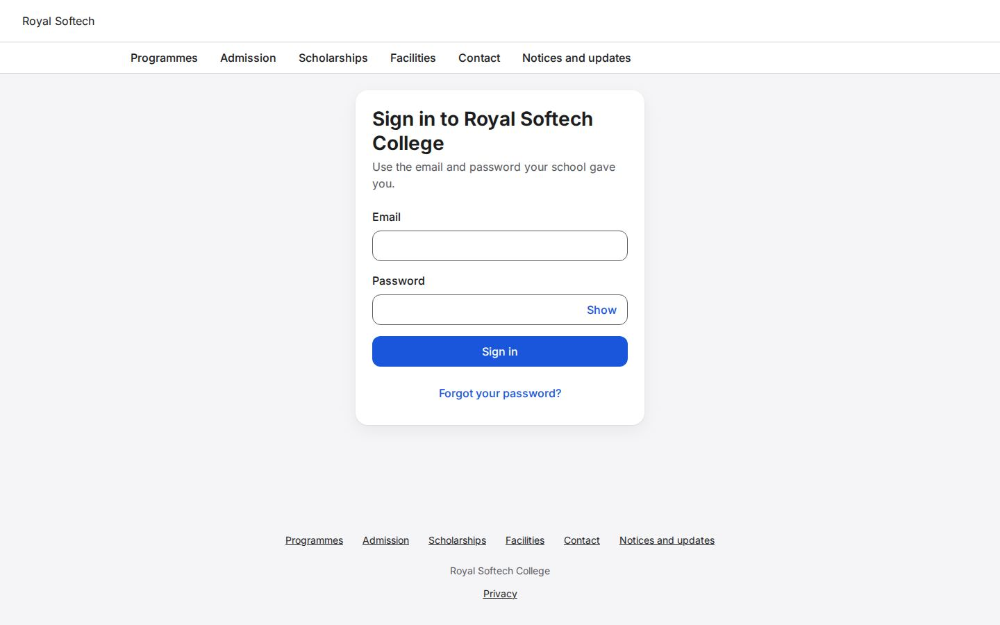

**01-02** Sign in with nothing typed: both fields are asked for

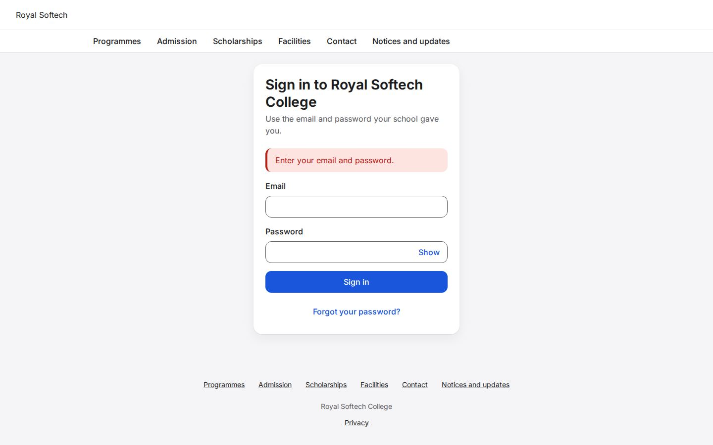

**01-03** A wrong password: a plain message that does not say which part is wrong

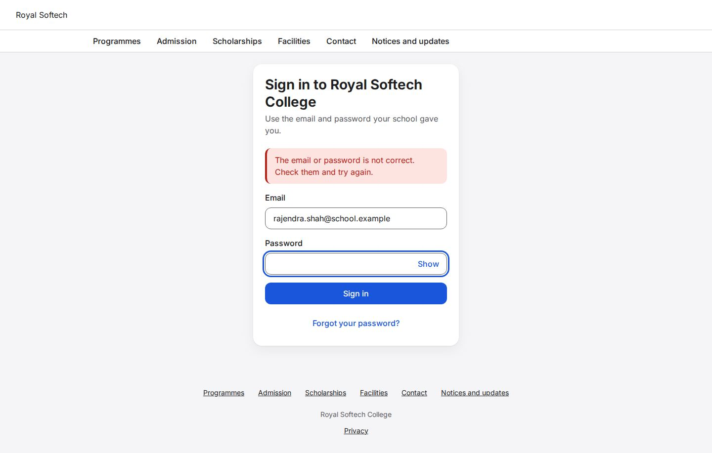

**01-04** Show password reveals what was typed before signing in

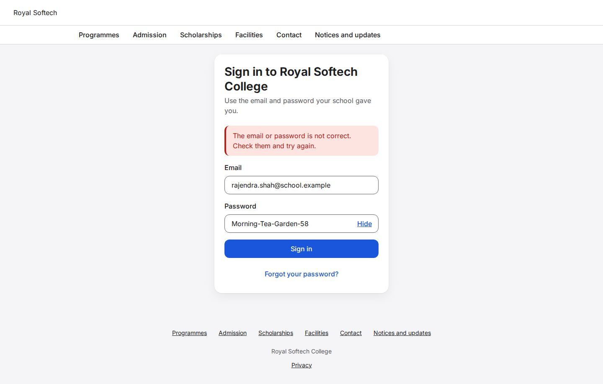

**01-05** First sign-in of a Principal: two-step sign-in must be set up (QR code and setup key)

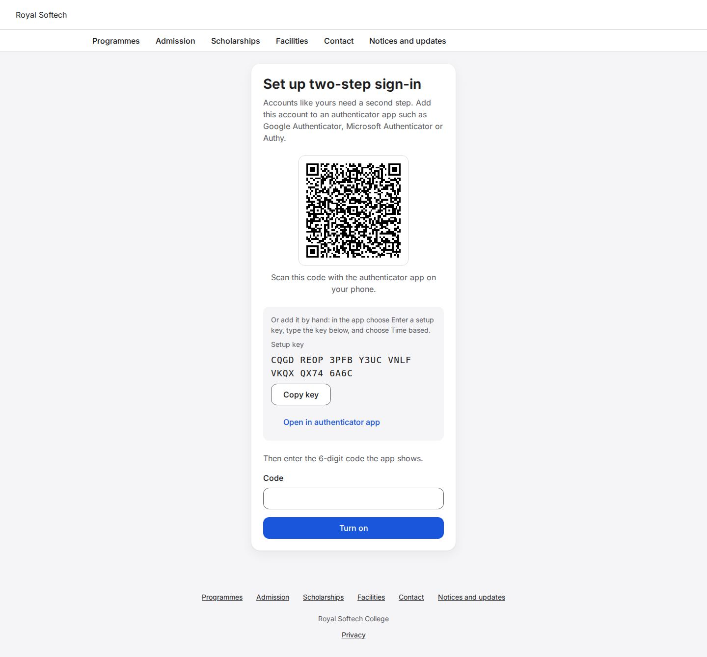

**01-06** A wrong code from the app is refused

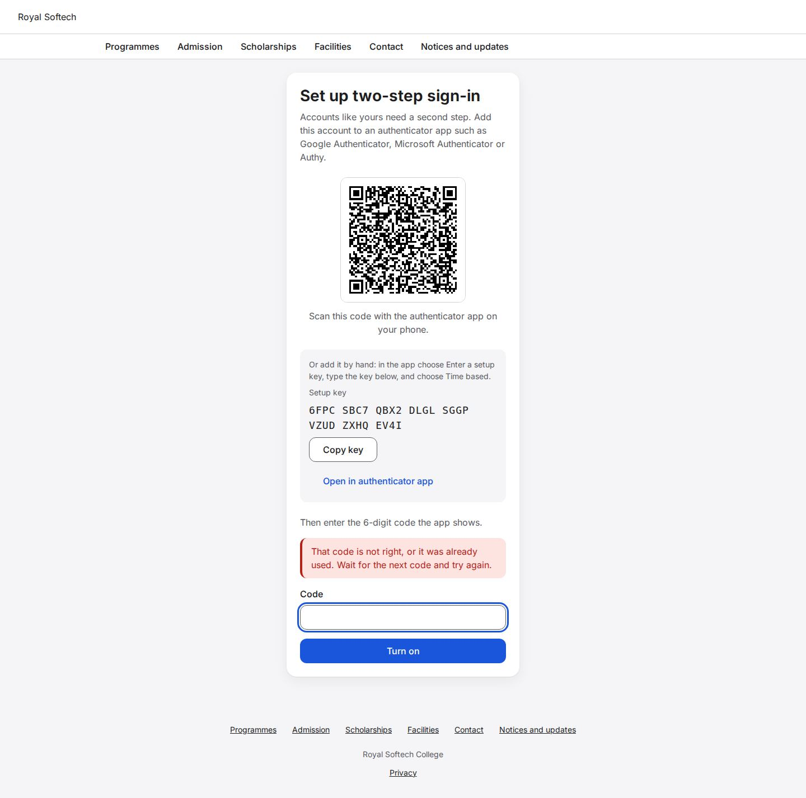

**01-07** Ten recovery codes are shown once (blurred here would be wise in a real school)

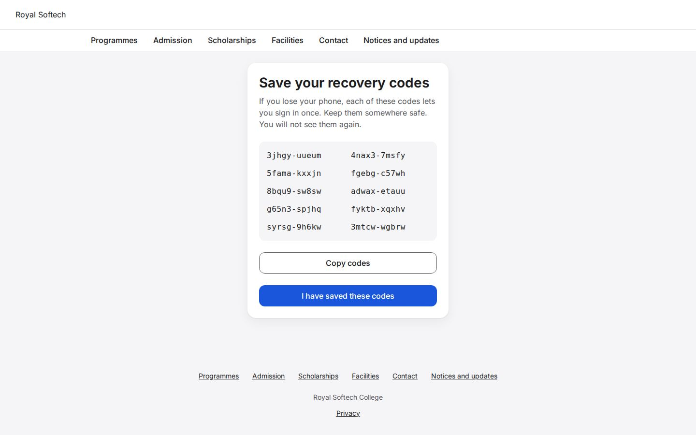

**01-08** Signed in: the Principal's dashboard on a brand-new school with no data

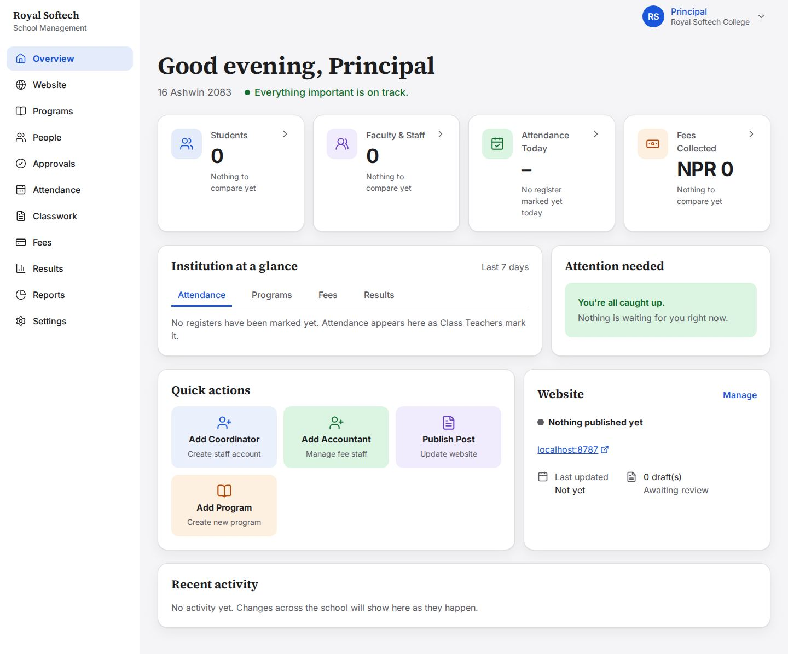

## 2. Programs: sections

The Principal builds the school's sections (D-095). No section is built in: a new school starts with none.

| # | Step | Result | Page |
|---|---|---|---|
| [02-01](#02-01-programs-empty) | Programs (Academic Structure) on a new school: no sections yet, one action to start | Pass | `/portal/setup/programmes` |
| [02-02](#02-02-section-name-required) | Add a Section with no name: the name is asked for | Pass | `/portal/setup/programmes` |
| [02-03](#02-03-section-name-typed) | Add a Section: typing the section's name | Pass | `/portal/setup/programmes` |
| [02-04](#02-04-first-section-added) | The first section is added, with no programmes in it yet | Pass | `/portal/setup/programmes` |
| [02-05](#02-05-three-sections) | Three sections: +2, Bachelor's and Master's | Pass | `/portal/setup/programmes` |
| [02-06](#02-06-section-duplicate-name) | A second section with the same name is refused ("That already exists."); the message shows on the page behind the dialog (finding F-01) | See F-01 | `/portal/setup/programmes` |

**02-01** Programs (Academic Structure) on a new school: no sections yet, one action to start

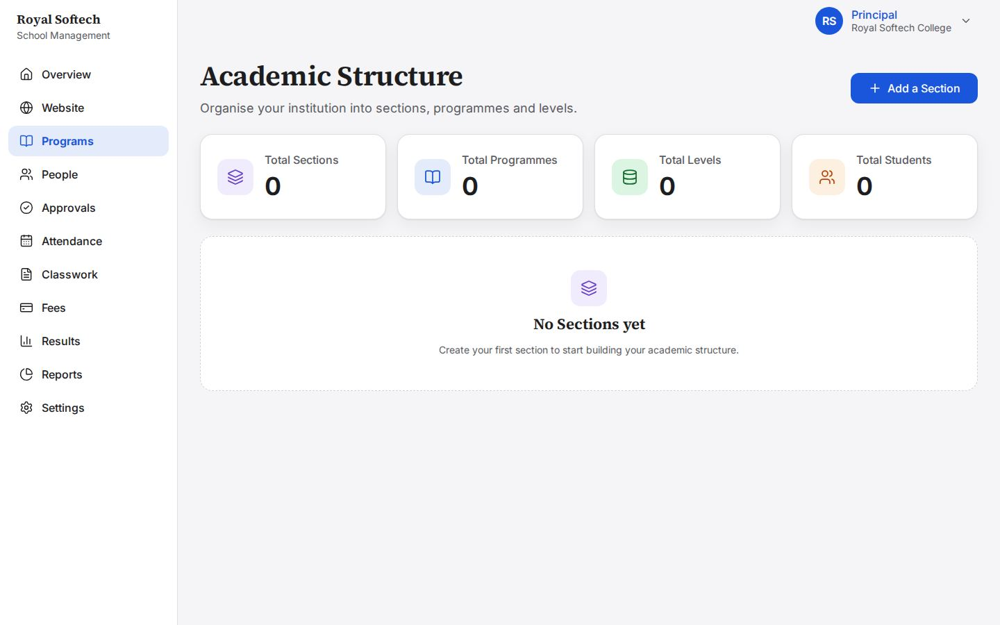

**02-02** Add a Section with no name: the name is asked for

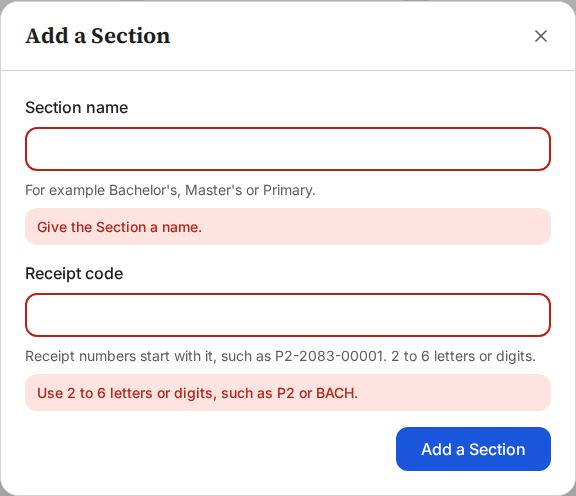

**02-03** Add a Section: typing the section's name

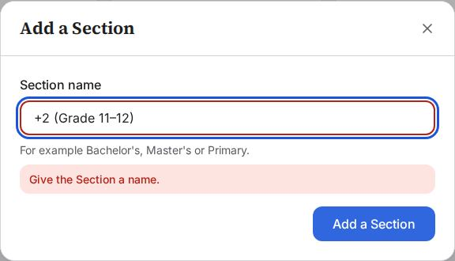

**02-04** The first section is added, with no programmes in it yet

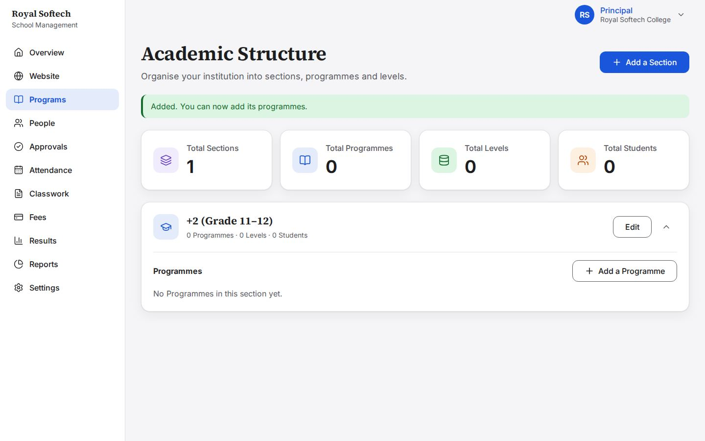

**02-05** Three sections: +2, Bachelor's and Master's

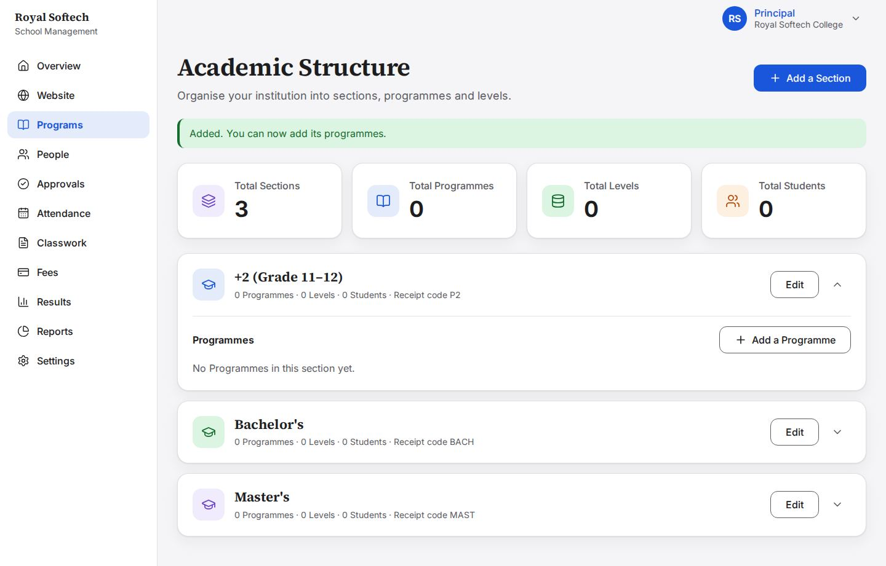

**02-06** A second section with the same name is refused ("That already exists."); the message shows on the page behind the dialog (finding F-01)

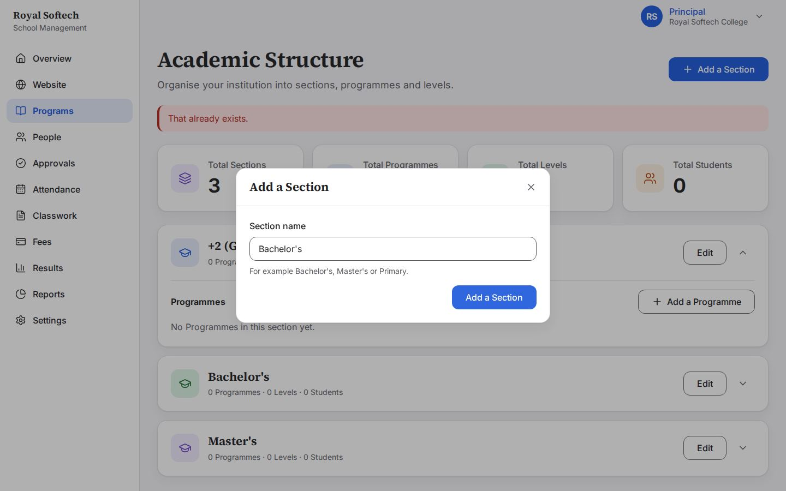

## 3. Programs: programmes, levels and grading

Programmes inside sections, their levels, the grading policy, rename, switch off and on, delete.

| # | Step | Result | Page |
|---|---|---|---|
| [03-01](#03-01-programme-name-required) | Add a Programme with no name: the name is asked for | Pass | `/portal/setup/programmes` |
| [03-02](#03-02-programme-form-filled) | Add a Programme: name and affiliation | See F-02 | `/portal/setup/programmes` |
| [03-03](#03-03-programme-added) | The programme is added to the +2 section, with no levels yet | Pass | `/portal/setup/programmes` |
| [03-04](#03-04-level-name-required) | Add a Level with no name: the name is asked for | Pass | `/portal/setup/programmes` |
| [03-05](#03-05-levels-added) | +2 Science now has Grade 11 and Grade 12 | Pass | `/portal/setup/programmes` |
| [03-06](#03-06-full-structure) | The full structure: 3 sections, 5 programmes, 11 levels | Pass | `/portal/setup/programmes` |
| [03-07](#03-07-programme-edit) | Edit a programme: name, affiliation and grading (results cannot be published until grading is set) | Pass | `/portal/setup/programmes` |
| [03-08](#03-08-grading-set) | Grading set: NEB GPA for +2, percentage and division for the bachelor's and master's programmes | Pass | `/portal/setup/programmes` |
| [03-09](#03-09-level-options) | A level's options: rename, switch off, delete (delete only while nothing is attached) | Pass | `/portal/setup/programmes` |
| [03-10](#03-10-level-renamed) | The level is renamed to Year 1 | Pass | `/portal/setup/programmes` |
| [03-11](#03-11-level-switched-off) | The level is switched off: it stays, marked Switched off, and nothing is lost | Pass | `/portal/setup/programmes` |
| [03-12](#03-12-level-delete-confirm) | Delete asks once more, because it cannot be undone | Pass | `/portal/setup/programmes` |
| [03-13](#03-13-programme-deleted) | The empty MBS programme is deleted | Pass | `/portal/setup/programmes` |
| [03-14](#03-14-section-edit) | Edit a section: rename, switch off, delete | Pass | `/portal/setup/programmes` |
| [03-15](#03-15-section-switched-off) | Master's Degrees is renamed and switched off: kept, but no longer offered | Pass | `/portal/setup/programmes` |
| [03-16](#03-16-section-in-use-no-delete) | A section with programmes cannot be deleted: it says why and suggests switching it off | Pass | `/portal/setup/programmes` |

**03-01** Add a Programme with no name: the name is asked for

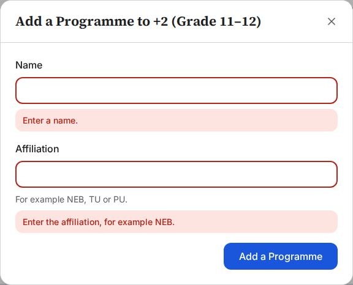

**03-02** Add a Programme: name and affiliation

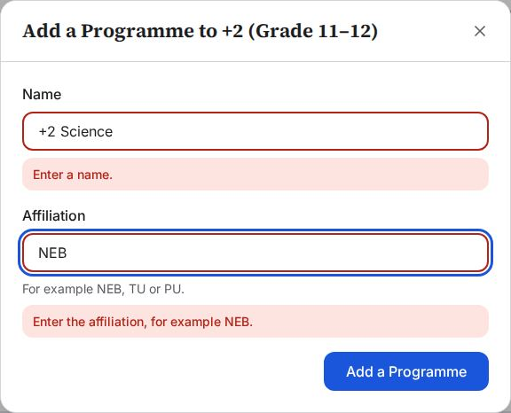

**03-03** The programme is added to the +2 section, with no levels yet

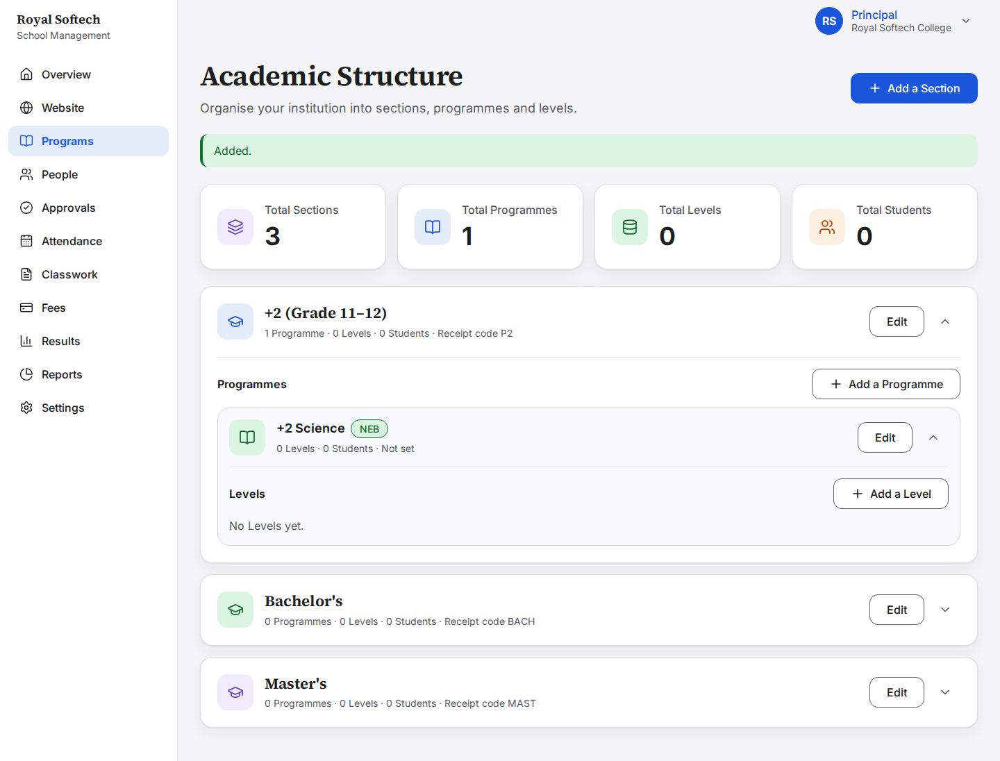

**03-04** Add a Level with no name: the name is asked for

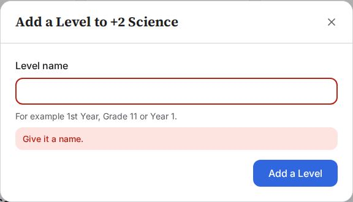

**03-05** +2 Science now has Grade 11 and Grade 12

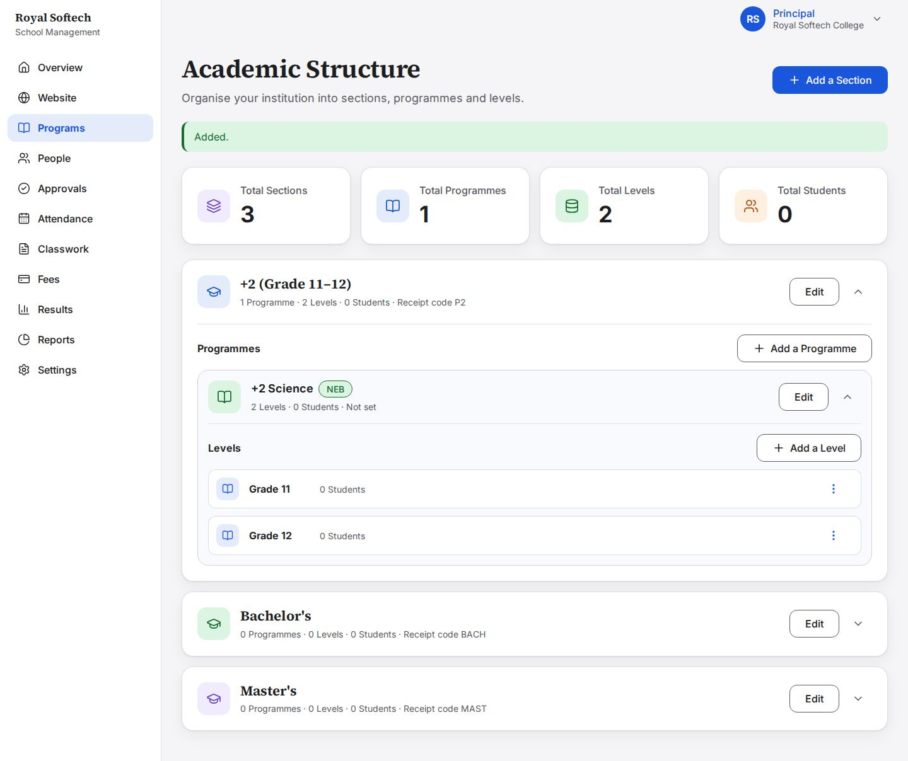

**03-06** The full structure: 3 sections, 5 programmes, 11 levels

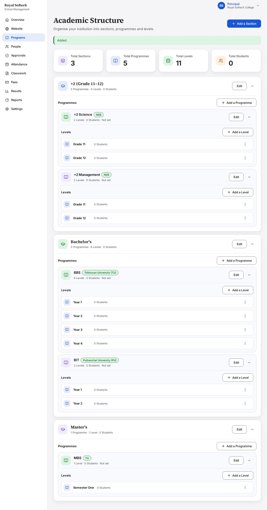

**03-07** Edit a programme: name, affiliation and grading (results cannot be published until grading is set)

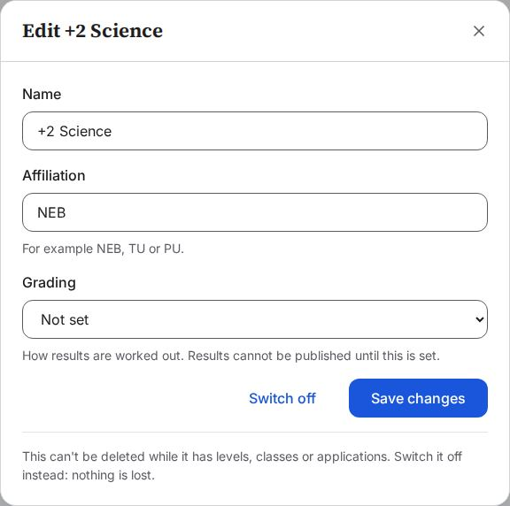

**03-08** Grading set: NEB GPA for +2, percentage and division for the bachelor's and master's programmes

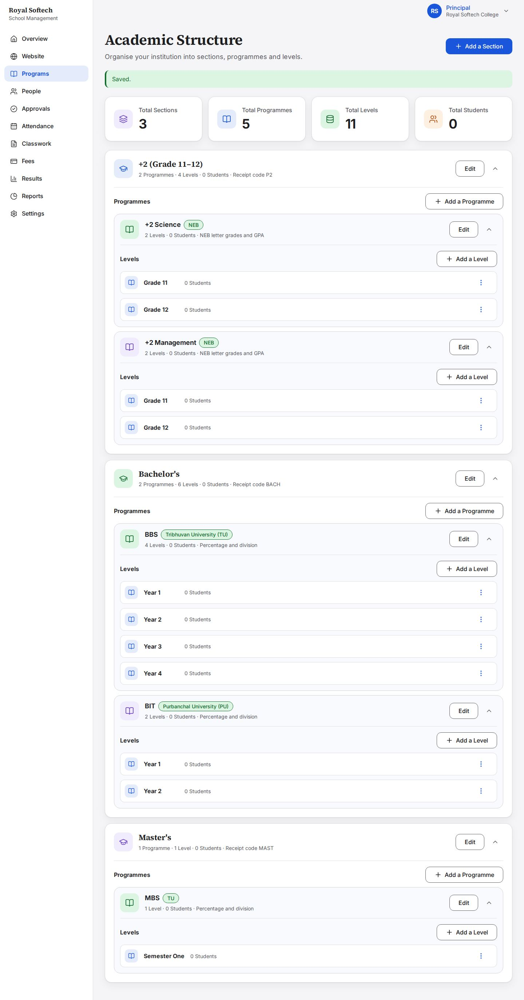

**03-09** A level's options: rename, switch off, delete (delete only while nothing is attached)

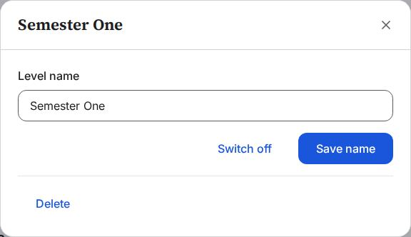

**03-10** The level is renamed to Year 1

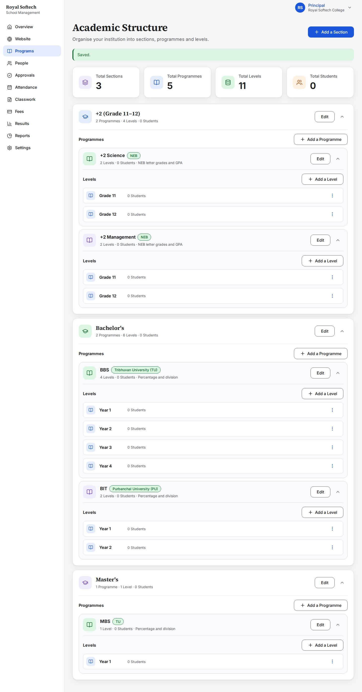

**03-11** The level is switched off: it stays, marked Switched off, and nothing is lost

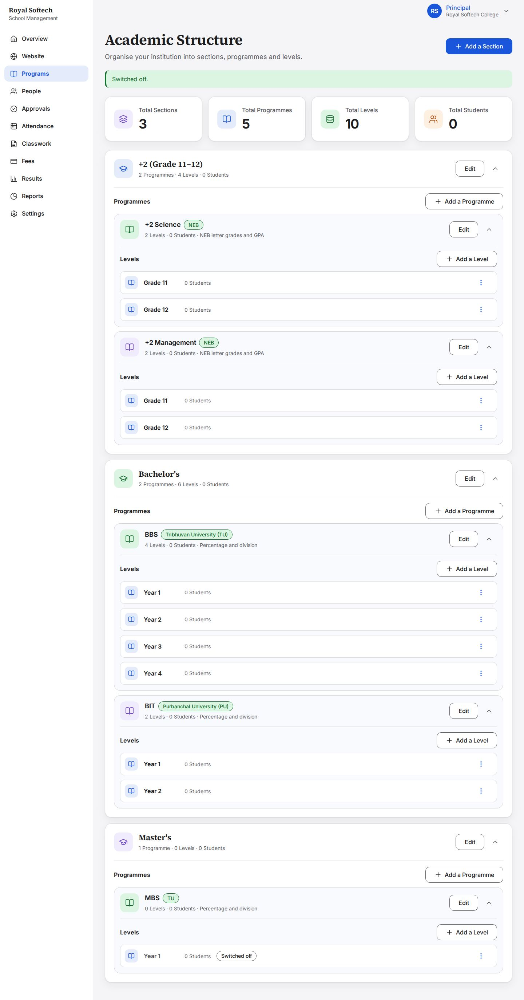

**03-12** Delete asks once more, because it cannot be undone

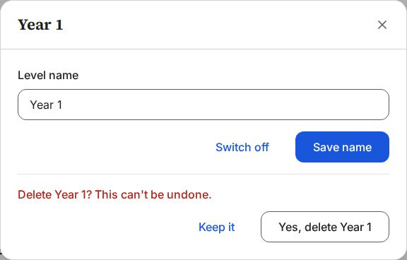

**03-13** The empty MBS programme is deleted

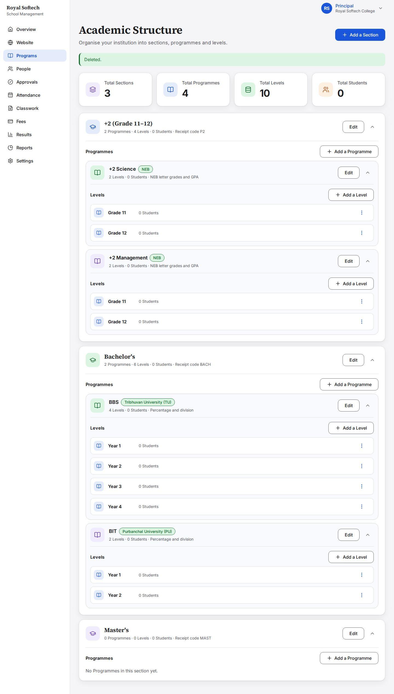

**03-14** Edit a section: rename, switch off, delete

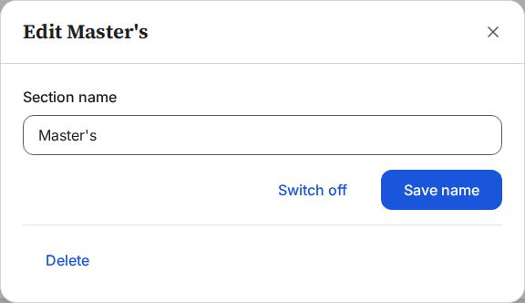

**03-15** Master's Degrees is renamed and switched off: kept, but no longer offered

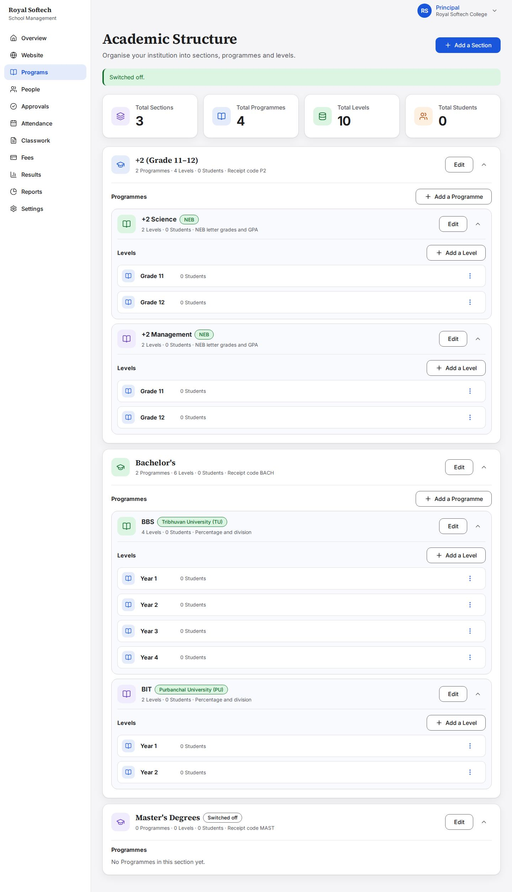

**03-16** A section with programmes cannot be deleted: it says why and suggests switching it off

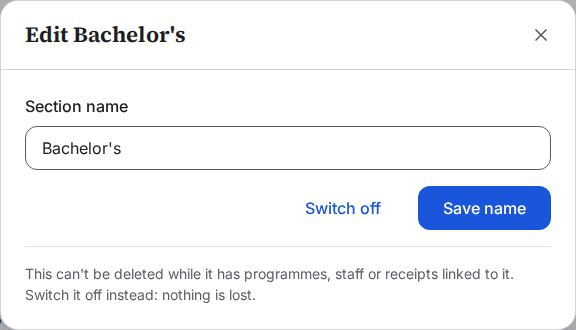

## 4. People & Access: Co-ordinators and Accountants

The Principal gives access to Co-ordinators and Accountants (never teachers), chooses where it reaches, and manages it (D-099).

| # | Step | Result | Page |
|---|---|---|---|
| [04-01](#04-01-people-empty) | People & Access on a new school: counts at zero, How access works, no staff yet | Pass | `/portal/people` |
| [04-02](#04-02-how-access-works) | How access works, opened: who gives access to whom | Pass | `/portal/people` |
| [04-03](#04-03-add-step-role) | Add a person, step 1 Role: only Co-ordinator or Accountant; teachers are added by a Co-ordinator | Pass | `/portal/people` |
| [04-04](#04-04-add-role-required) | Next without a role: Choose a role | Pass | `/portal/people` |
| [04-05](#04-05-add-details-invalid) | Step 2 Details: a one-letter name, a bad email and a too-short phone are each explained | Pass | `/portal/people` |
| [04-06](#04-06-add-details-filled) | Step 2 Details filled in | Pass | `/portal/people` |
| [04-07](#04-07-add-access-none-chosen) | Step 3 Access: Selected sections with none ticked is refused | Pass | `/portal/people` |
| [04-08](#04-08a-add-access-whole) | Step 3 Access: the whole school | Pass | `/portal/people` |
| [04-08](#04-08b-add-access-sections) | Step 3 Access: only the sections chosen (the switched-off Master's Degrees is not offered) | Pass | `/portal/people` |
| [04-09](#04-09-add-review) | Step 4 Review: everything once more before the account is made | Pass | `/portal/people` |
| [04-10](#04-10-temporary-password) | The temporary password is shown once, to give to the person; they must change it at first sign-in | Pass | `/portal/people` |
| [04-11](#04-11-four-staff) | Four staff: two Co-ordinators and two Accountants, whole school or one section each | Pass | `/portal/people` |
| [04-12](#04-12-duplicate-email) | An email already in use is refused, and nothing typed is lost | Pass | `/portal/people` |
| [04-13](#04-13-manage-access) | Manage access: the person, role, account, sign-in, where their access reaches, and what the role can do | Pass | `/portal/people` |
| [04-14](#04-14-manage-access-changed) | Adding +2 to Hari's sections: Save access is now available | Pass | `/portal/people` |
| [04-15](#04-15-access-saved) | Access saved: Hari now reaches +2 and Bachelor's | Pass | `/portal/people` |
| [04-16](#04-16-switched-off) | Ramesh is switched off: kept, marked Inactive, cannot sign in; nothing is deleted | Pass | `/portal/people` |
| [04-17](#04-17-row-menu-inactive) | The row's More menu for a switched-off person | Pass | `/portal/people` |
| [04-18](#04-18-switched-on) | Ramesh is switched on again; he can sign in once more | Pass | `/portal/people` |
| [04-19](#04-19-new-temporary-password) | Manage access › New temporary password for Gita: shown once, on the page, to give her in person | Pass | `/portal/people` |
| [04-20](#04-20-search) | Search 'hari': only Hari Prasad Yadav | Pass | `/portal/people` |
| [04-21](#04-21-search-none) | A search that matches nobody says so | Pass | `/portal/people` |
| [04-22](#04-22-filter-role) | Filter Role: Accountants only | Pass | `/portal/people` |
| [04-23](#04-23-filter-access) | Filter Access: the first section choice | Pass | `/portal/people` |
| [04-24](#04-24-teaching-empty) | Teaching tab before any teacher exists: teachers are added by a Co-ordinator | Pass | `/portal/people` |

**04-01** People & Access on a new school: counts at zero, How access works, no staff yet

**04-02** How access works, opened: who gives access to whom

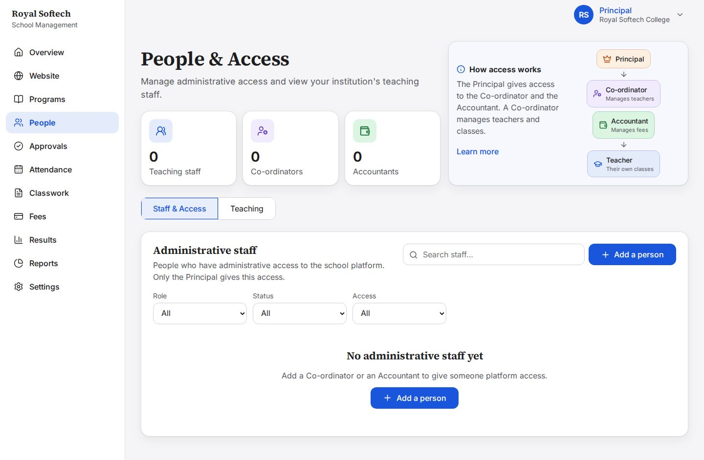

**04-03** Add a person, step 1 Role: only Co-ordinator or Accountant; teachers are added by a Co-ordinator

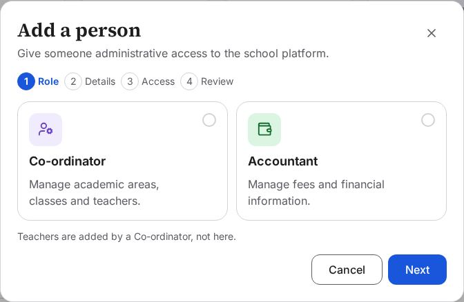

**04-04** Next without a role: Choose a role

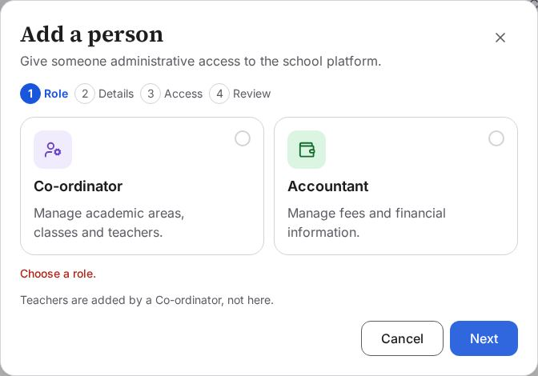

**04-05** Step 2 Details: a one-letter name, a bad email and a too-short phone are each explained

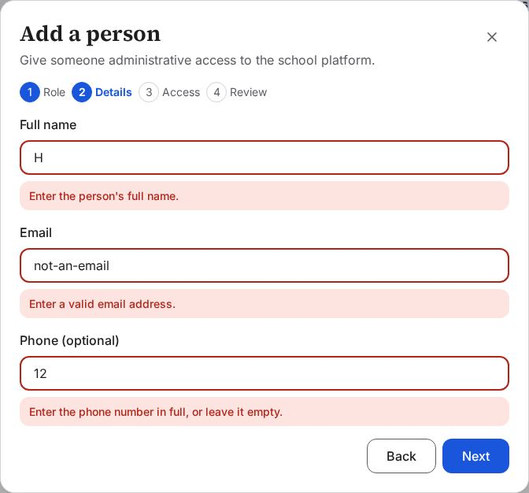

**04-06** Step 2 Details filled in

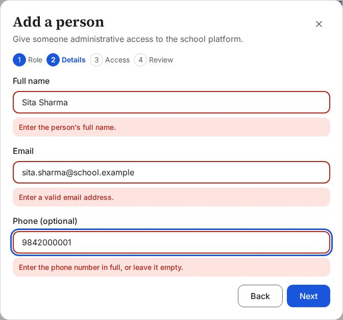

**04-07** Step 3 Access: Selected sections with none ticked is refused

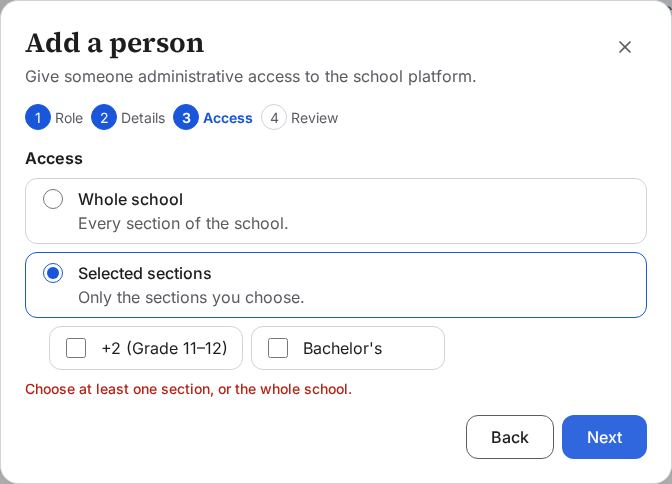

**04-08** Step 3 Access: the whole school

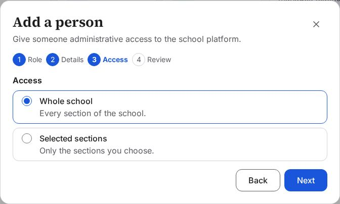

**04-08** Step 3 Access: only the sections chosen (the switched-off Master's Degrees is not offered)

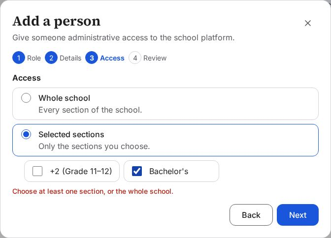

**04-09** Step 4 Review: everything once more before the account is made

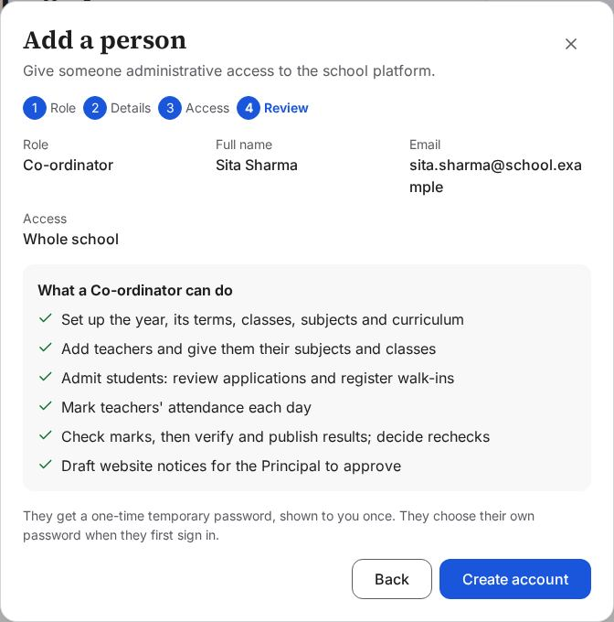

**04-10** The temporary password is shown once, to give to the person; they must change it at first sign-in

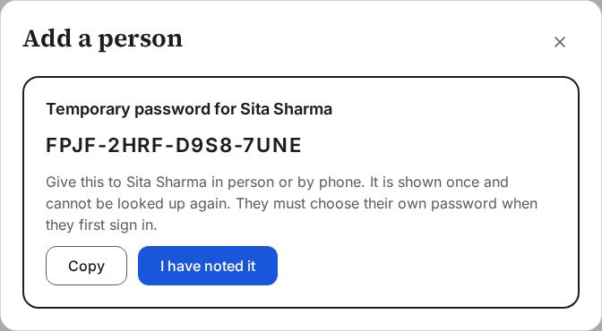

**04-11** Four staff: two Co-ordinators and two Accountants, whole school or one section each

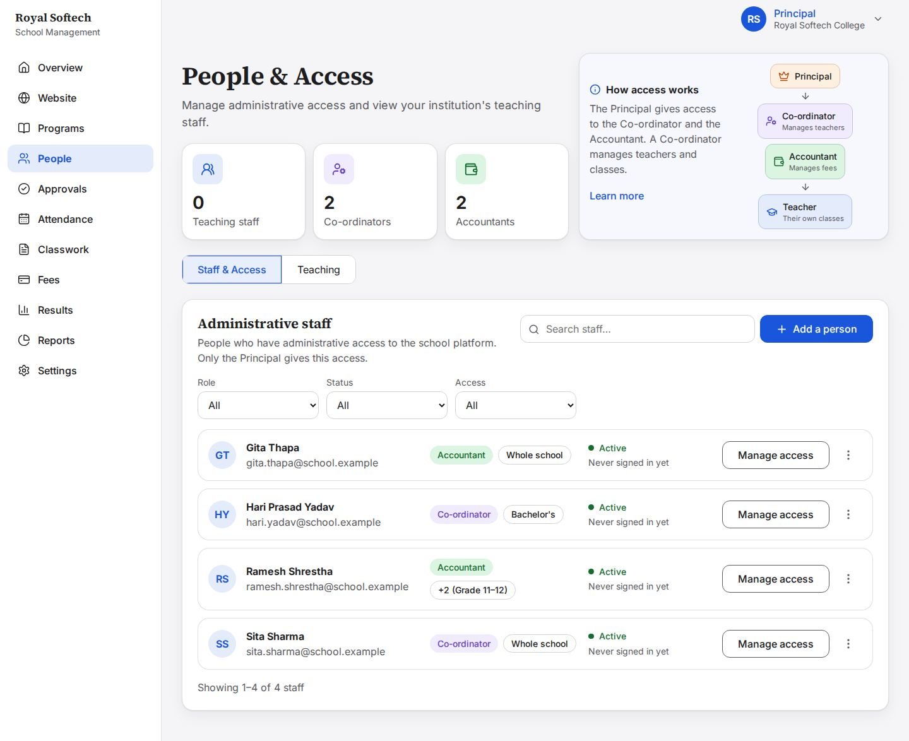

**04-12** An email already in use is refused, and nothing typed is lost

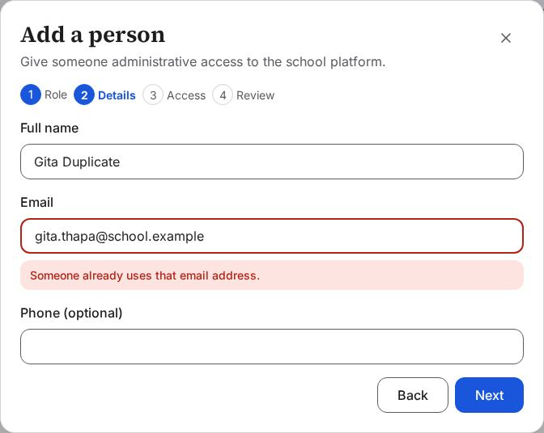

**04-13** Manage access: the person, role, account, sign-in, where their access reaches, and what the role can do

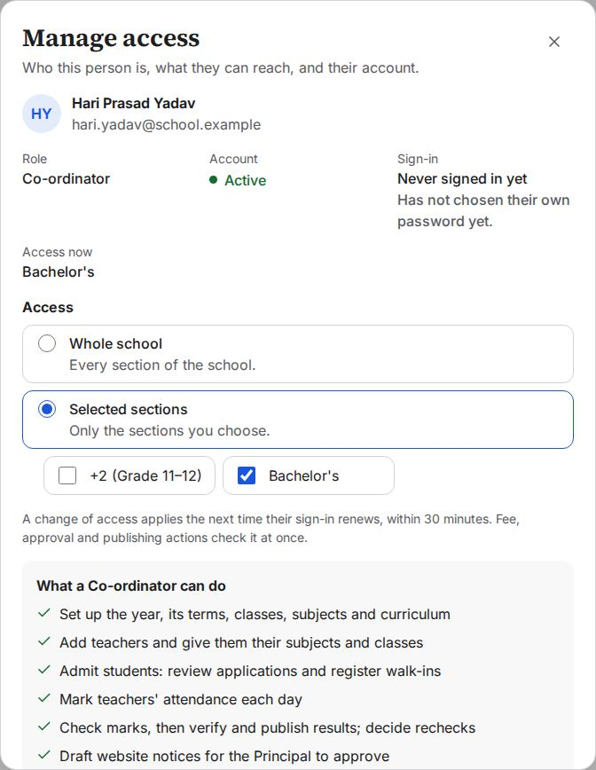

**04-14** Adding +2 to Hari's sections: Save access is now available

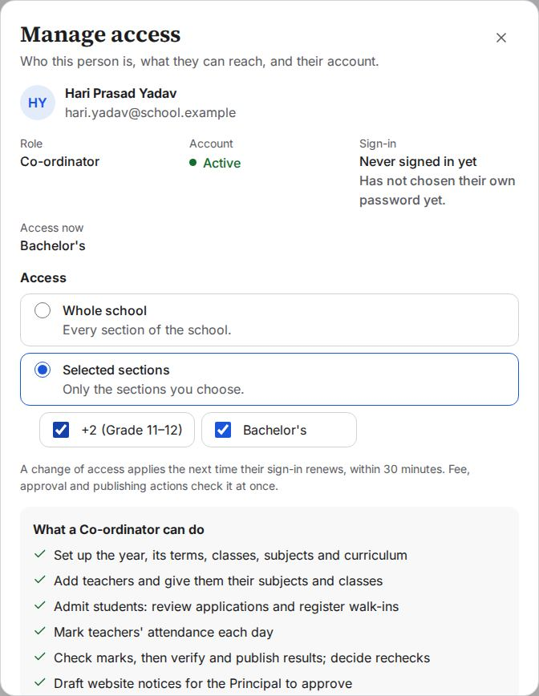

**04-15** Access saved: Hari now reaches +2 and Bachelor's

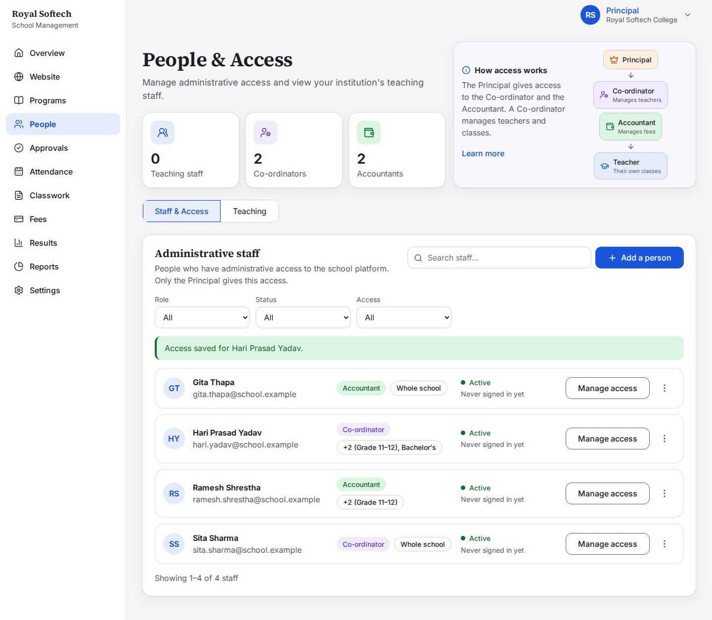

**04-16** Ramesh is switched off: kept, marked Inactive, cannot sign in; nothing is deleted

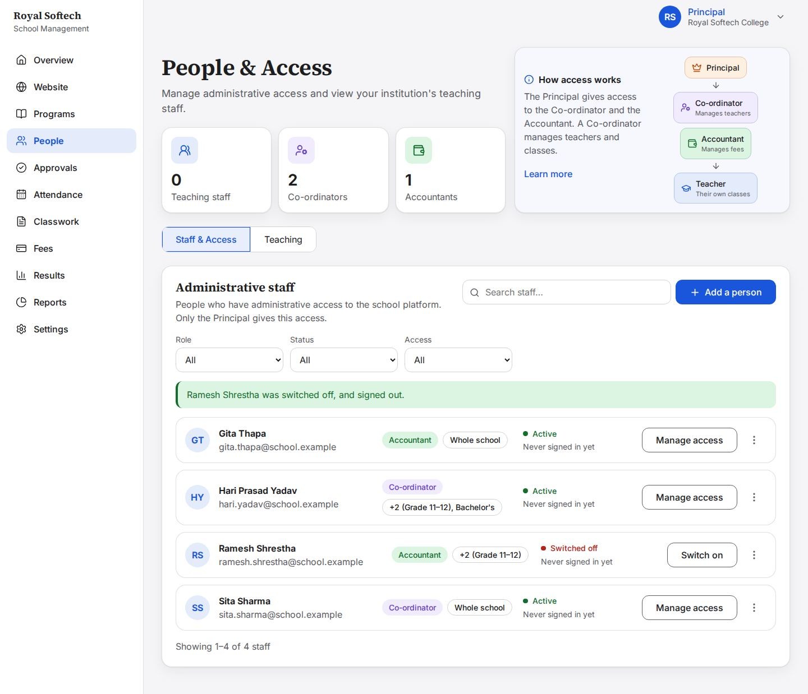

**04-17** The row's More menu for a switched-off person

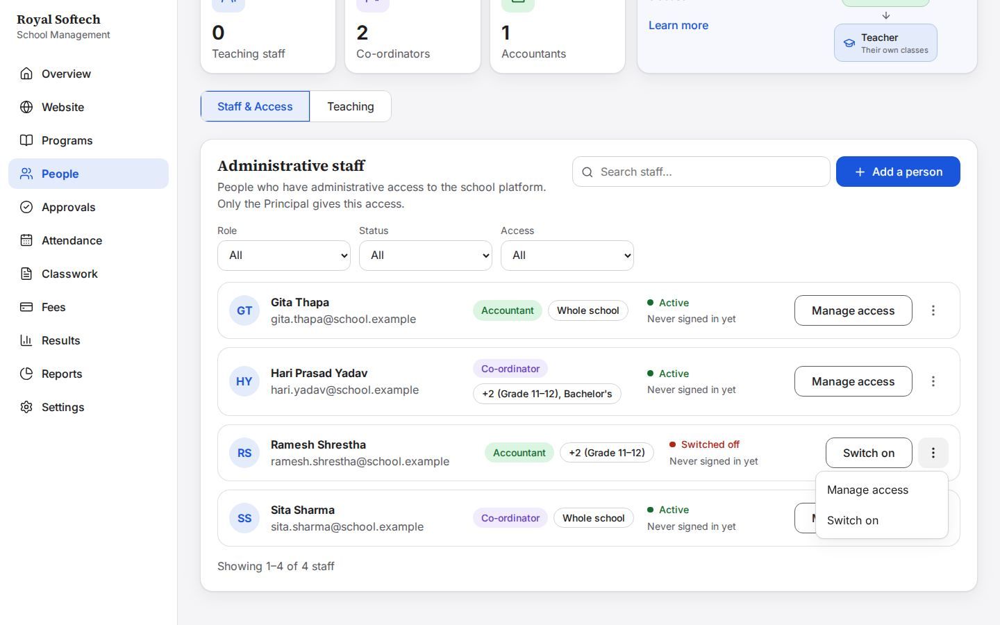

**04-18** Ramesh is switched on again; he can sign in once more

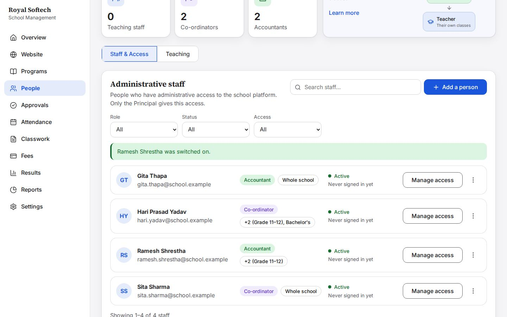

**04-19** Manage access › New temporary password for Gita: shown once, on the page, to give her in person

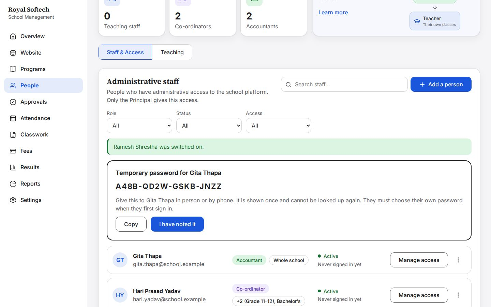

**04-20** Search 'hari': only Hari Prasad Yadav

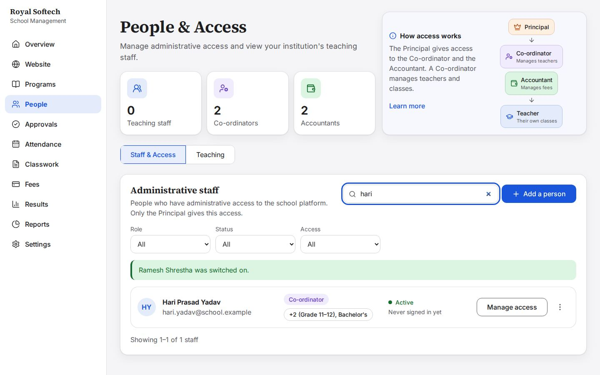

**04-21** A search that matches nobody says so


**04-22** Filter Role: Accountants only


**04-23** Filter Access: the first section choice


**04-24** Teaching tab before any teacher exists: teachers are added by a Co-ordinator


## 5. Approvals: fee structures and website drafts

Requests from the Accountant and the Co-ordinator, approved or declined with a reason.

**Precondition (P1):** the Co-ordinator set up the year, classes, subjects, teachers and 17 students; teachers marked attendance, wrote the activity log and entered marks; results were published; the Accountant sent three fee structures; the Co-ordinator sent two website drafts.

| # | Step | Result | Page |
|---|---|---|---|
| [05-01](#05-01-dashboard-with-requests) | The dashboard once the school is running: counts, attendance, and five requests needing the Principal | See F-04, F-05, F-11 | `/portal` |
| [05-02](#05-02-approvals-inbox) | Approvals inbox: three fee structures from the Accountant and two website drafts from the Co-ordinator | Pass | `/portal/approvals` |
| [05-03](#05-03-fee-structure-approved) | Grade 11 fee structure approved: it leaves the inbox and becomes the live structure | Pass | `/portal/approvals` |
| [05-04](#05-04-decline-opened) | Decline opens a box for the reason; the Decline button stays disabled until a reason is written | Pass | `/portal/approvals` |
| [05-05](#05-05-fee-structure-declined) | BBS Year 1 fee structure declined with a reason; it goes back to the Accountant | Pass | `/portal/approvals` |
| [05-06](#05-06-notice-approved) | Grade 12 fees and the Co-ordinator's notice approved; the notice is published on the website at once | Pass | `/portal/approvals` |
| [05-07](#05-07-inbox-empty) | Every request decided: the inbox is empty and the menu badge is gone | See F-03 | `/portal/approvals` |

**05-01** The dashboard once the school is running: counts, attendance, and five requests needing the Principal


**05-02** Approvals inbox: three fee structures from the Accountant and two website drafts from the Co-ordinator


**05-03** Grade 11 fee structure approved: it leaves the inbox and becomes the live structure


**05-04** Decline opens a box for the reason; the Decline button stays disabled until a reason is written


**05-05** BBS Year 1 fee structure declined with a reason; it goes back to the Accountant


**05-06** Grade 12 fees and the Co-ordinator's notice approved; the notice is published on the website at once


**05-07** Every request decided: the inbox is empty and the menu badge is gone


## 6. Approvals: money requests

Discounts, a refund, a payment reversal and a corrected fee structure. Approve-and-apply happens once, even from two tabs.

**Precondition (P2):** the Accountant charged the approved fee structures, recorded payments and a verified voucher, and sent two discounts, a refund, a reversal and the corrected BBS fee structure for approval.

| # | Step | Result | Page |
|---|---|---|---|
| [06-01](#06-01-money-requests) | The Accountant's requests: two discounts, a refund, a payment reversal and the corrected BBS fee structure | See F-06 | `/portal/approvals` |
| [06-02](#06-02-discount-approved) | Sita Chaudhary's discount approved: it is added to her fee account in the same step | Pass | `/portal/approvals` |
| [06-03](#06-03-discount-decline-reason) | Declining Rohan Sah's 50% discount, with the reason the Accountant will see | Pass | `/portal/approvals` |
| [06-04](#06-04-refund-approved) | Puja Yadav's refund approved; the Accountant can now record how it was paid | Pass | `/portal/approvals` |
| [06-05](#06-05-refund-already-decided) | The same refund approved again from a second, older tab: refused as already decided; nothing is applied twice | See F-07 | `/portal/approvals` |
| [06-06](#06-06-all-decided) | The reversal and the corrected BBS structure approved; nothing is waiting | Pass | `/portal/approvals` |

**06-01** The Accountant's requests: two discounts, a refund, a payment reversal and the corrected BBS fee structure


**06-02** Sita Chaudhary's discount approved: it is added to her fee account in the same step


**06-03** Declining Rohan Sah's 50% discount, with the reason the Accountant will see


**06-04** Puja Yadav's refund approved; the Accountant can now record how it was paid


**06-05** The same refund approved again from a second, older tab: refused as already decided; nothing is applied twice


**06-06** The reversal and the corrected BBS structure approved; nothing is waiting


## 7. Reading the school: attendance, classwork, fees, results, reports

Everything the Principal reads but does not change.

| # | Step | Result | Page |
|---|---|---|---|
| [07-01](#07-01-attendance-classes) | Attendance: today's register for each class; Grade 12 has not been marked yet | Pass | `/portal/attendance` |
| [07-02](#07-02-attendance-class) | A class's register for today (two absent) and the year so far; the Principal can look but not mark | Pass | `/portal/attendance/class?id=daedf06dcee94d2a0bc6893e4c4ff8f7` |
| [07-03](#07-03-attendance-not-marked) | Grade 12: no register marked yet today | Pass | `/portal/attendance/class?id=080a4f2cbc4ce347bd60c68c24daf5d1` |
| [07-04](#07-04-teacher-attendance) | Teacher attendance for today, marked by the Co-ordinator (Suresh Karki on leave); read only for the Principal | Pass | `/portal/attendance/teachers` |
| [07-05](#07-05a-incomplete-date) | A date with only the day filled in (no month or year) is refused, but the message says the day is not in the verified calendar (finding F-19) | See F-19 | `/portal/attendance/teachers` |
| [07-05](#07-05b-teacher-attendance-other-day) | Another day, 15 Ashwin 2083: nothing was marked that day | Pass | `/portal/attendance/teachers` |
| [07-06](#07-06-unverified-year) | 1 Baisakh 2090, outside the verified calendar (2000 to 2083), is refused | Pass | `/portal/attendance/teachers` |
| [07-07](#07-07-classwork) | Classwork: today's activity log for each class | Pass | `/portal/classwork` |
| [07-08](#07-08-classwork-class) | Grade 11's activity log today: what each subject teacher wrote, and the subjects with nothing yet | Pass | `/portal/classwork/class?id=daedf06dcee94d2a0bc6893e4c4ff8f7` |
| [07-09](#07-09-fees-find) | Fees: find a student's fee account by name, SID or phone | Pass | `/portal/fees` |
| [07-10](#07-10-fees-search) | Searching 'Sita': the matching student | Pass | `/portal/fees` |
| [07-11](#07-11-fee-account-discount) | Sita Chaudhary's fee account: charges, her cash payment and the approved 10% discount; the balance is worked out, never stored | Pass | `/portal/fees/student?id=30d515cbc43ccd140b245a15df9c29a2` |
| [07-12](#07-12-fee-account-refund) | Puja Yadav (found by SID): overpaid, with the approved refund | Pass | `/portal/fees/student?id=e838ebbbbddb9b39aee3c880a4b041f2` |
| [07-13](#07-13-fee-account-reversal) | Nabin Thakur: the wrong payment and its approved reversal, both kept in the ledger | Pass | `/portal/fees/student?id=fee0ef79302feab3630b105ea5a23ac4` |
| [07-14](#07-14-fee-account-receipts) | Aarav Mandal: a cash payment (sent twice, recorded once) and a verified bank voucher, each with a receipt | Pass | `/portal/fees/student?id=82296920a0c77f9c97e279f5a35898bd` |
| [07-15](#07-15-receipt) | A receipt, generated from the ledger, never edited | See F-18 | `/portal/fees/receipt?id=97615db160f9e834b512cdb992ee3a62` |
| [07-16](#07-16-fees-search-none) | A search that finds nobody | Pass | `/portal/fees` |
| [07-17](#07-17-fee-structures) | Fee structures for the year: live (approved) ones | Pass | `/portal/fees/structures` |
| [07-18](#07-18-fee-structure) | The Grade 11 fee structure: monthly, yearly and one-time items; read only for the Principal | Pass | `/portal/fees/structure?id=8d6a970b53c236146e4ae3f0e6486bea` |
| [07-19](#07-19-dues) | Dues: what each student owes and how much is overdue, with a CSV download | See F-10 | `/portal/fees/dues` |
| [07-20](#07-20-results-changes) | Results: changes after publishing (rechecks); none yet | Pass | `/portal/results` |
| [07-21](#07-21-class-sheets) | Class sheets: choose a class and a published terminal | Pass | `/portal/results/sheets` |
| [07-22](#07-22-class-sheet) | Grade 11, first terminal: every student's NEB grades and GPA, ranked; ties share a rank | Pass | `/portal/results/sheets` |
| [07-23](#07-23-top20) | Top 20, ranked per section, only from published results | Pass | `/portal/results/top20` |
| [07-24](#07-24-reports) | Reports: everything the Principal reads but does not change, in one place | Pass | `/portal/reports` |
| [07-25](#07-25-setup) | Academic years: the current year and its dates (read only for the Principal) | Pass | `/portal/setup` |
| [07-26](#07-26-classes) | Classes this year (read only) | Pass | `/portal/setup/classes` |
| [07-27](#07-27-terminals) | Terminals of the year (read only) | Pass | `/portal/setup/terminals` |
| [07-28](#07-28-subjects) | The school's subjects (read only) | Pass | `/portal/setup/subjects` |
| [07-29](#07-29-curriculum) | Curriculum: what each level studies, credit hours and marks (read only) | Pass | `/portal/setup/curriculum` |
| [07-30](#07-30-teaching) | Teaching: who teaches what, and each Class Teacher | Pass | `/portal/people/teaching` |
| [07-31](#07-31-student-search) | Find a student: 'Rai' finds Suman Rai | See F-09 | `/portal/admissions/search` |
| [07-33](#07-33-register-tab-not-allowed) | The Register tab beside Student search, opened by the Principal | See F-08 | `/portal/admissions/register` |

**07-01** Attendance: today's register for each class; Grade 12 has not been marked yet


**07-02** A class's register for today (two absent) and the year so far; the Principal can look but not mark


**07-03** Grade 12: no register marked yet today


**07-04** Teacher attendance for today, marked by the Co-ordinator (Suresh Karki on leave); read only for the Principal


**07-05** A date with only the day filled in (no month or year) is refused, but the message says the day is not in the verified calendar (finding F-19)


**07-05** Another day, 15 Ashwin 2083: nothing was marked that day


**07-06** 1 Baisakh 2090, outside the verified calendar (2000 to 2083), is refused


**07-07** Classwork: today's activity log for each class


**07-08** Grade 11's activity log today: what each subject teacher wrote, and the subjects with nothing yet


**07-09** Fees: find a student's fee account by name, SID or phone


**07-10** Searching 'Sita': the matching student


**07-11** Sita Chaudhary's fee account: charges, her cash payment and the approved 10% discount; the balance is worked out, never stored


**07-12** Puja Yadav (found by SID): overpaid, with the approved refund


**07-13** Nabin Thakur: the wrong payment and its approved reversal, both kept in the ledger


**07-14** Aarav Mandal: a cash payment (sent twice, recorded once) and a verified bank voucher, each with a receipt


**07-15** A receipt, generated from the ledger, never edited


**07-16** A search that finds nobody


**07-17** Fee structures for the year: live (approved) ones


**07-18** The Grade 11 fee structure: monthly, yearly and one-time items; read only for the Principal


**07-19** Dues: what each student owes and how much is overdue, with a CSV download


**07-20** Results: changes after publishing (rechecks); none yet


**07-21** Class sheets: choose a class and a published terminal


**07-22** Grade 11, first terminal: every student's NEB grades and GPA, ranked; ties share a rank


**07-23** Top 20, ranked per section, only from published results


**07-24** Reports: everything the Principal reads but does not change, in one place


**07-25** Academic years: the current year and its dates (read only for the Principal)


**07-26** Classes this year (read only)

**07-27** Terminals of the year (read only)


**07-28** The school's subjects (read only)


**07-29** Curriculum: what each level studies, credit hours and marks (read only)


**07-30** Teaching: who teaches what, and each Class Teacher

**07-31** Find a student: 'Rai' finds Suman Rai


**07-33** The Register tab beside Student search, opened by the Principal


## 8. Website Content

All seven kinds of content, scheduling, hide-after, holidays, validation, filters, search, edit, take down, archive, and the public website (D-098).

| # | Step | Result | Page |
|---|---|---|---|
| [08-01](#08-01-website-content) | Website Content: the published notice (approved earlier) and the declined event, back as a draft | Pass | `/portal/content` |
| [08-02](#08-02-new-content-types) | New content: seven types, each with its own icon | Pass | `/portal/content` |
| [08-03](#08-03-new-content-empty) | Publish with nothing filled in: the type, title and content are asked for | Pass | `/portal/content` |
| [08-04](#08-04-news-form) | A News item: bold text and a bulleted list from the toolbar, marked urgent, with the live preview | See F-12 | `/portal/content` |
| [08-05](#08-05-news-published) | Published at once: it is on the website now | Pass | `/portal/content` |
| [08-06](#08-06-holiday-end-before-start) | A holiday that ends (2 Bhadra) before it starts (24 Ashwin) is refused | Pass | `/portal/content` |
| [08-07](#08-07-holiday-form) | Holiday from 24 Ashwin to 2 Kartik 2083; it hides itself after the last day | Pass | `/portal/content` |
| [08-08](#08-08-hide-after-before-publish) | Hide after 10 Ashwin, before today's publish date, is refused | Pass | `/portal/content` |
| [08-09](#08-09-vacancy-form) | A vacancy with a contact, shown until 30 Kartik | Pass | `/portal/content` |
| [08-10](#08-10-event-scheduled-form) | An event set to publish on 18 Ashwin at 09:00, Nepal time | Pass | `/portal/content` |
| [08-11](#08-11-event-scheduled) | Scheduled: it goes on the website by itself at that date and time | Pass | `/portal/content` |
| [08-12](#08-12-information-draft) | Information saved as a draft: kept, not on the website | Pass | `/portal/content` |
| [08-13](#08-13-unverified-year) | A publish date in BS 2090, outside the verified calendar, is refused | Pass | `/portal/content` |
| [08-14](#08-14-list-all) | All items: summary counts, published, scheduled and draft, urgent marked | Pass | `/portal/content` |
| [08-15](#08-15-filter-type) | Type filter: Holiday | Pass | `/portal/content` |
| [08-16](#08-16-filter-scheduled) | Status filter: Scheduled | Pass | `/portal/content` |
| [08-17](#08-17-filter-draft) | Status filter: Draft | Pass | `/portal/content` |
| [08-18](#08-18-search) | Search 'teacher': the vacancy | Pass | `/portal/content` |
| [08-19](#08-19-edit-declined-draft) | Editing the event the Principal declined: the date, time and venue added | Pass | `/portal/content` |
| [08-20](#08-20-row-menu) | A published item's menu: take down or archive | Pass | `/portal/content` |
| [08-21](#08-21-taken-down) | Taken down: it is a draft again, with Undo | Pass | `/portal/content` |
| [08-22](#08-22-archived) | The routine archived: off the website, kept in the archive | Pass | `/portal/content` |
| [08-23](#08-23-public-home) | The public website's home page with the latest updates | Pass | `/` |
| [08-24](#08-24-public-notices) | Notices and updates on the public website: urgent news, the holiday, the vacancy and the quiz; the scheduled meeting and the draft are not shown | Pass | `/notices` |

**08-01** Website Content: the published notice (approved earlier) and the declined event, back as a draft


**08-02** New content: seven types, each with its own icon


**08-03** Publish with nothing filled in: the type, title and content are asked for


**08-04** A News item: bold text and a bulleted list from the toolbar, marked urgent, with the live preview


**08-05** Published at once: it is on the website now


**08-06** A holiday that ends (2 Bhadra) before it starts (24 Ashwin) is refused


**08-07** Holiday from 24 Ashwin to 2 Kartik 2083; it hides itself after the last day


**08-08** Hide after 10 Ashwin, before today's publish date, is refused


**08-09** A vacancy with a contact, shown until 30 Kartik


**08-10** An event set to publish on 18 Ashwin at 09:00, Nepal time


**08-11** Scheduled: it goes on the website by itself at that date and time


**08-12** Information saved as a draft: kept, not on the website


**08-13** A publish date in BS 2090, outside the verified calendar, is refused


**08-14** All items: summary counts, published, scheduled and draft, urgent marked


**08-15** Type filter: Holiday


**08-16** Status filter: Scheduled


**08-17** Status filter: Draft


**08-18** Search 'teacher': the vacancy


**08-19** Editing the event the Principal declined: the date, time and venue added


**08-20** A published item's menu: take down or archive


**08-21** Taken down: it is a draft again, with Undo


**08-22** The routine archived: off the website, kept in the archive


**08-23** The public website's home page with the latest updates


**08-24** Notices and updates on the public website: urgent news, the holiday, the vacancy and the quiz; the scheduled meeting and the draft are not shown


## 9. Own account: profile, password, sign-out, recovery code, password reset, lockout

The Principal's own account and its security rules.

| # | Step | Result | Page |
|---|---|---|---|
| [09-01](#09-01-settings) | Settings: your profile, change your password, sign out | Pass | `/portal/settings` |
| [09-02](#09-02-profile-name-required) | Saving the profile with no name is refused | Pass | `/portal/settings` |
| [09-03](#09-03-profile-saved) | Name and phone saved | Pass | `/portal/settings` |
| [09-04](#09-04-password-wrong-current) | Change password with a wrong current password is refused | Pass | `/portal/settings` |
| [09-05](#09-05-password-common) | A common new password is refused | Pass | `/portal/settings` |
| [09-06](#09-06-password-school-name) | A new password containing the school's name is refused | Pass | `/portal/settings` |
| [09-07](#09-07-password-too-short) | A new password under 10 characters is refused | Pass | `/portal/settings` |
| [09-08](#09-08-password-changed) | The password is changed | Pass | `/portal/settings` |
| [09-09](#09-09-signed-out) | Signed out: back on the sign-in page | Pass | `/sign-in` |
| [09-10](#09-10-portal-after-sign-out) | Opening a portal page after signing out asks to sign in again | Pass | `/sign-in` |
| [09-11](#09-11-old-password-refused) | The old password no longer works | Pass | `/sign-in` |
| [09-12](#09-12-code-step) | The new password works; the authenticator code is asked for | Pass | `/sign-in` |
| [09-13](#09-13-code-wrong) | A wrong code is refused | Pass | `/sign-in` |
| [09-14](#09-14-recovery-code) | Signing in with one of the saved recovery codes instead | Pass | `/sign-in` |
| [09-14](#09-14b-throttled-after-five-failures) | Found in the clean run: five failed sign-in steps for one email within 15 minutes (a wrong password, the old password, a wrong code) lock the email, and even a correct recovery code is refused until the lock lifts. This is the lockout rule working as written (CLAUDE.md section 4). | Pass | `/sign-in` |
| [09-15](#09-15-signed-in-with-recovery) | Signed in with a recovery code; that code is now used up | Pass | `/portal` |
| [09-16](#09-16-recovery-code-reused) | The same recovery code a second time is refused: each works once | Pass | `/sign-in` |
| [09-17](#09-17-forgot-password) | Forgot your password: ask for a reset link | Pass | `/reset-password` |
| [09-18](#09-18-reset-sent) | The same answer whether or not the email has an account, so nobody can probe for accounts | Pass | `/reset-password` |
| [09-19](#09-19-mailbox-reset-email) | The test mailbox (only where email is not really sent) shows the reset email | Pass | `/portal/mailbox` |
| [09-20](#09-20-reset-new-password) | The reset link opens Choose a new password | Pass | `/reset-password#token=cVJQi3XypnYcBNj6SWVNcL0TpbdJhR3qINPqVckJCB4` |
| [09-21](#09-21-reset-weak) | A new password with the school's name in it is refused here too | Pass | `/reset-password#token=cVJQi3XypnYcBNj6SWVNcL0TpbdJhR3qINPqVckJCB4` |
| [09-22](#09-22-reset-done) | Password changed; sign in with the new one | Pass | `/reset-password` |
| [09-23](#09-23-reset-link-reused) | The same reset link opened again: refused, the link expired or was already used | Pass | `/reset-password#token=cVJQi3XypnYcBNj6SWVNcL0TpbdJhR3qINPqVckJCB4` |
| [09-24](#09-24-lockout) | Six wrong tries for one email (even an unknown one): Too many attempts, wait a few minutes | Pass | `/sign-in` |
| [09-25](#09-25-signed-in-new-password) | Signed in with the reset password and the authenticator code | Pass | `/portal` |

**09-01** Settings: your profile, change your password, sign out


**09-02** Saving the profile with no name is refused


**09-03** Name and phone saved


**09-04** Change password with a wrong current password is refused


**09-05** A common new password is refused


**09-06** A new password containing the school's name is refused

**09-07** A new password under 10 characters is refused


**09-08** The password is changed


**09-09** Signed out: back on the sign-in page

**09-10** Opening a portal page after signing out asks to sign in again

**09-11** The old password no longer works


**09-12** The new password works; the authenticator code is asked for


**09-13** A wrong code is refused


**09-14** Signing in with one of the saved recovery codes instead


**09-14** Found in the clean run: five failed sign-in steps for one email within 15 minutes (a wrong password, the old password, a wrong code) lock the email, and even a correct recovery code is refused until the lock lifts. This is the lockout rule working as written (CLAUDE.md section 4).

**09-15** Signed in with a recovery code; that code is now used up


**09-16** The same recovery code a second time is refused: each works once


**09-17** Forgot your password: ask for a reset link


**09-18** The same answer whether or not the email has an account, so nobody can probe for accounts


**09-19** The test mailbox (only where email is not really sent) shows the reset email


**09-20** The reset link opens Choose a new password


**09-21** A new password with the school's name in it is refused here too


**09-22** Password changed; sign in with the new one


**09-23** The same reset link opened again: refused, the link expired or was already used


**09-24** Six wrong tries for one email (even an unknown one): Too many attempts, wait a few minutes

**09-25** Signed in with the reset password and the authenticator code

## 10. What the Principal must not do

Other roles' pages opened by address, and the server's answer to forbidden actions.

| # | Step | Result | Page |
|---|---|---|---|
| [10-01](#10-01-admissions-queue) | The Co-ordinator's admissions queue, opened by address | See F-14 | `/portal/admissions` |
| [10-02](#10-02-register-form) | Register a student (the Accountant's), opened by address | See F-14 | `/portal/admissions/register` |
| [10-03](#10-03-vouchers) | The Accountant's voucher checks, opened by address | See F-14 | `/portal/fees/vouchers` |
| [10-04](#10-04-results-review) | The Co-ordinator's marks review, opened by address | See F-14 | `/portal/results/review` |
| [10-05](#10-05-attendance-mine) | A teacher's own attendance page, opened by address | See F-14 | `/portal/attendance/mine` |
| [10-06](#10-06-classes-read-only) | Classes: the Principal can look; adding and changing is the Co-ordinator's | Pass | `/portal/setup/classes` |
| [10-07](#10-07-own-request) | The Principal's own request in the inbox: it cannot be approved by the person who sent it | See F-13 | `/portal/approvals` |
| [10-08](#10-08-own-request-approve-refused) | Approving one's own request is refused by the server; the message shown is misleading (finding F-13) | See F-13 | `/portal/approvals` |

**10-01** The Co-ordinator's admissions queue, opened by address


**10-02** Register a student (the Accountant's), opened by address


**10-03** The Accountant's voucher checks, opened by address


**10-04** The Co-ordinator's marks review, opened by address


**10-05** A teacher's own attendance page, opened by address


**10-06** Classes: the Principal can look; adding and changing is the Co-ordinator's


**10-07** The Principal's own request in the inbox: it cannot be approved by the person who sent it


**10-08** Approving one's own request is refused by the server; the message shown is misleading (finding F-13)


### The server's answers

Each request below was sent with the Principal's own signed-in browser cookies, as a screen would send it.

| What the Principal tried | Request | Answer |
|---|---|---|
| Create a teacher (the Co-ordinator's) | `POST /api/teachers` | 403 forbidden |
| Create another Admin (Support only) | `POST /api/staff` | 400 (refused: the role must be Co-ordinator or Accountant) |
| Switch off a teacher (the Co-ordinator's) | `PATCH /api/staff/{id}` | 403 forbidden |
| New temporary password for a teacher | `POST /api/staff/{id}/temporary-password` | 403 forbidden |
| Make an academic year (the Co-ordinator's) | `POST /api/academics/years` | 403 forbidden |
| Make a class (the Co-ordinator's) | `POST /api/academics/classes` | 403 forbidden |
| Register a walk-in student | `POST /api/admissions/walk-ins` | 403 forbidden |
| Mark a class register | `PUT /api/attendance/classes/{id}/today` | 403 forbidden |
| Record a cash payment (the Accountant's) | `POST /api/fees/payments/cash` | 403 forbidden |
| Propose a discount (the Accountant's) | `POST /api/fees/enrollments/{id}/discounts` | 403 forbidden |
| Publish a class's results (the Co-ordinator's) | `POST /api/results/classes/{id}/publish` | 403 forbidden |
| Enter marks (a teacher's) | `PUT /api/results/classes/{id}/subjects/{id}/terminals/{id}` | 403 forbidden |
| Send own draft for approval | `POST /api/approvals` | 201 (allowed; see F-13) |
| Approve own request | `POST /api/approvals/{id}/approve` | 403 forbidden |
| Withdraw own request | `POST /api/approvals/{id}/withdraw` | 403 forbidden |

## 11. Phone and large text

The main screens at 375 px, and at 320 px with text at 200% (no sideways scrolling).

| # | Step | Result | Page |
|---|---|---|---|
| [11-01](#11-01-phone-dashboard) | Phone (375 px): the dashboard | See F-15 | `/portal` |
| [11-02](#11-02-phone-more) | Phone: the More tab lists the places that do not fit in the tab bar | Pass | `/portal/more` |
| [11-03](#11-03-phone-people) | Phone: People & Access | Pass | `/portal/people` |
| [11-04](#11-04-phone-website) | Phone: Website Content | Pass | `/portal/content` |
| [11-05](#11-05-phone-approvals) | Phone: Approvals | Pass | `/portal/approvals` |
| [11-06](#11-06-phone-programs) | Phone: Programs | Pass | `/portal/setup/programmes` |
| [11-07](#11-07-phone-dues) | Phone: Dues | Pass | `/portal/fees/dues` |
| [11-08](#11-08-phone-sheets) | Phone: Class sheets | See F-15 | `/portal/results/sheets` |
| [11-09](#11-09-320-dashboard) | 320 px wide, text at 200%: the dashboard | Pass | `/portal` |
| [11-10](#11-10-320-people) | 320 px wide, text at 200%: People & Access | Pass | `/portal/people` |
| [11-11](#11-11-320-website) | 320 px wide, text at 200%: Website Content (FINDING: the page scrolls sideways by 10 px) | See F-17 | `/portal/content` |
| [11-12](#11-12-320-sign-in) | 320 px wide, text at 200%: the sign-in page scrolls sideways by 14 px (finding F-16) | See F-16 | `/sign-in` |

**11-01** Phone (375 px): the dashboard


**11-02** Phone: the More tab lists the places that do not fit in the tab bar


**11-03** Phone: People & Access


**11-04** Phone: Website Content


**11-05** Phone: Approvals


**11-06** Phone: Programs


**11-07** Phone: Dues


**11-08** Phone: Class sheets


**11-09** 320 px wide, text at 200%: the dashboard


**11-10** 320 px wide, text at 200%: People & Access


**11-11** 320 px wide, text at 200%: Website Content (FINDING: the page scrolls sideways by 10 px)


**11-12** 320 px wide, text at 200%: the sign-in page scrolls sideways by 14 px (finding F-16)


## 12. End of the run

People & Access and the dashboard once the school year is under way.

| # | Step | Result | Page |
|---|---|---|---|
| [12-01](#12-01-people-after-year) | People & Access after the year started: 6 teaching staff; the staff who signed in show when | Pass | `/portal/people` |
| [12-02](#12-02-teaching) | Teaching: every teacher with their subjects, section and programme, who added them, status and last sign-in | Pass | `/portal/people` |
| [12-03](#12-03-teaching-section) | Teaching filtered to the Bachelor's section | Pass | `/portal/people` |
| [12-04](#12-04-teaching-search) | Searching teachers: 'bikash' finds Bikash Chaudhary, with Mathematics and Physics | Pass | `/portal/people` |
| [12-05](#12-05-view-teaching) | View teaching: the Teaching report, read only for the Principal | Pass | `/portal/people/teaching` |
| [12-06](#12-06-dashboard-end) | The dashboard at the end of the test: fees collected, attendance, website updated, recent activity | Pass | `/portal` |
| [12-07](#12-07-glance-fees) | Institution at a glance: the Fees tab | Pass | `/portal` |
| [12-07](#12-07-glance-programs) | Institution at a glance: the Programs tab | Pass | `/portal` |
| [12-07](#12-07-glance-results) | Institution at a glance: the Results tab | Pass | `/portal` |

**12-01** People & Access after the year started: 6 teaching staff; the staff who signed in show when


**12-02** Teaching: every teacher with their subjects, section and programme, who added them, status and last sign-in


**12-03** Teaching filtered to the Bachelor's section


**12-04** Searching teachers: 'bikash' finds Bikash Chaudhary, with Mathematics and Physics


**12-05** View teaching: the Teaching report, read only for the Principal


**12-06** The dashboard at the end of the test: fees collected, attendance, website updated, recent activity


**12-07** Institution at a glance: the Fees tab


**12-07** Institution at a glance: the Programs tab


**12-07** Institution at a glance: the Results tab


## Findings

Severity: **High** blocks the Principal's work; **Medium** gives wrong or missing information on a real task; **Low** is confusing but has a way round; **Cosmetic** is appearance only.

| ID | Severity | Where | What happens | Steps |
|---|---|---|---|---|
| F-01 | Low | Programs › Add a Section | A duplicate section name is refused ("That already exists."), but the message shows on the page behind the open dialog, dimmed by the backdrop; the dialog itself stays unchanged. | 02-06 |
| F-02 | High (fixed) | Programs › Add a Programme | Adding any programme failed with "That is not allowed. Check what you entered." The form sent gradingPolicy: null, which the API's strict body refuses. Fixed in apps/web/src/setup/client.ts; regression test in setup-client.test.ts. | 03-02 |
| F-03 | Low | Approvals › menu badge | After the Principal decides every request, the inbox says "Nothing is waiting for a decision" but the menu badge still shows the old count until the page is reloaded. | 05-07 |
| F-04 | Low | Overview › Recent activity | An admission entry reads "Application approved; student <32-character internal id> created" instead of naming the student and their SID. | 05-01 |
| F-05 | Cosmetic | Overview › Institution at a glance | The attendance chart's top axis label is cut: "00%" instead of "100%". | 05-01 |
| F-06 | Medium | Approvals › Discount | A discount request does not show its reason (Scholarship, Sibling, Staff child, Other). Sita Chaudhary's 10% Sibling discount shows only "Discount of NPR 4,450.00 for Sita Chaudhary", and the Accountant's note ("Her brother Rohit is in Grade 12") is not shown. An "Other" discount shows its note but not the reason. The Principal approves money without seeing why. | 06-01 |
| F-07 | Low | Approvals › deciding twice | Approving a refund from a second, older tab after it was already approved is refused correctly (nothing is applied twice), but the message says "That changed since it was sent. Send it again to reconsider it." The request was not changed; it was already decided. The web client maps every 409 to "stale" (apps/web/src/approvals/client.ts:59), assuming an already-decided request cannot be reached, which two open tabs disprove. | 06-05 |
| F-08 | Medium | Find a student › Register tab | The Principal sees a Register tab beside Student search, and it opens the full "Register a student" form. The Principal may not register students (admissions.student.register is the Accountant's), and the server refuses the request (403 forbidden, checked directly), but the form should not be offered. | 07-33 |
| F-09 | Low | Find a student › result | A search result cannot be opened. The Principal has read access to a student's personal details (students.personal.view, and GET /api/students/{id} answers 200), but the result card is not a link, so the record cannot be seen from any screen. | 07-31 |
| F-10 | Low | Fees › Dues | Students in a class whose fee structure has not been charged yet (BBS Year 1) show a green "Paid up". Nothing was charged, so "Paid up" overstates it. | 07-19 |
| F-11 | Medium (gap) | Audit trail and Sign-ins | The Principal has audit.view, but no screen lists the audit trail or the sign-ins (CLAUDE.md section 6: "Sign-ins and failed 2FA go in a separate Sign-ins view"). Only the newest few entries appear under Recent activity on the dashboard. | 05-01 |
| F-12 | Low | Website › text toolbar | Pressing Bulleted list (or Numbered list) on an empty line does nothing and gives no sign why; a list is made only from lines selected first. The hint under the box says to select words first, but a list button that silently does nothing is easy to miss. | 08-04 |
| F-13 | Medium | Approvals › own request | The Principal can send their own draft for approval (POST /api/approvals answers 201), and it appears in their own inbox with Approve and Decline. Approving it is refused, which is correct (never your own request), but the message says "You no longer have permission to see this. Sign in again." The Principal also cannot withdraw it (403), so in a school with one Principal the request stays in the inbox, with the badge, until another Admin or Support decides it. | 10-07, 10-08 |
| F-14 | Low | Other roles' pages opened by address | Pages that belong to other roles answer in four different ways when the Principal opens them by address: Vouchers to check says "You do not have access to this page" (right); the marks review says "This could not be loaded. Check your connection and try again" (a refusal shown as a network problem); My attendance shows an empty teacher calendar; the admissions queue shows the Register form (F-08). The server refuses every action in all of them. | 10-01 to 10-05 |
| F-15 | Low | Phone tab bar | At 375 px the bottom tab bar does not fit on one row: "More" wraps to a second row on its own, and the Approvals badge sits under its label, so the bar takes two rows of the screen. | 11-01, 11-08 |
| F-16 | Low | Sign-in page at 320 px | At 320 px wide with text at 200%, the sign-in page scrolls sideways by 14 px (the house rule in D-030 is no sideways scroll). The portal pages checked the same way do not. | 11-12 |
| F-17 | Low | Website Content at 320 px | At 320 px wide with text at 200%, the "Waiting for approval" status label on a row does not wrap and pushes the page 10 px sideways. | 11-11 |
| F-18 | Medium | Fees › Receipt | The receipt number starts with the section's internal key: "s7e402b08e9-2083-00007". Since sections are made by the Admin with generated keys (D-095), every receipt a family keeps carries this code. The receipt date is also shown as 2083-06-16 rather than 16 Ashwin 2083 as elsewhere. | 07-15 |
| F-19 | Low | Dates › half-filled date | A date with only the day filled in is refused with "That day is not in the verified calendar", which suggests a calendar problem rather than asking for the month and year. | 07-05a |

Only F-02 was fixed in this round, because it blocked the test. The others are for the PM to schedule: most are small and local to one screen; F-11 is a missing screen, and F-18 touches how receipt numbers are formed, which belongs to the fees rules.

## What the Principal can do, and where it was tested

From the permission matrix (`apps/api/src/core/permissions/matrix.ts`), every action the Admin holds:

| Permission | What | Tested in |
|---|---|---|
| `auth.sign_in` | Sign in, reset own password | 01, 09 |
| `account.profile.edit` | Correct own name and phone | 09-01 to 09-03 |
| `accounts.staff.create` | Create a Co-ordinator or Accountant | 04-03 to 04-12 |
| `accounts.deactivate` | Switch off or on (Co-ordinators, Accountants) | 04-16 to 04-18; teachers refused in 10 |
| `accounts.staff.view` | View the staff list | 04, 12-01 to 12-05 |
| `accounts.staff.access` | Change where access reaches | 04-13 to 04-15 |
| `accounts.password.issue` | New temporary password (Co-ordinators, Accountants) | 04-19; teachers refused in 10 |
| `content.draft / content.publish` | Draft and publish website content | 08 |
| `setup.programmes.manage` | Sections, programmes, levels, grading | 02, 03 |
| `setup.structure.view / subjects.view / assignments.view` | View years, classes, terminals, subjects, curriculum, teaching | 07-25 to 07-30, 12-05 |
| `students.search / students.personal.view` | Find a student, view personal details | 07-31 (record view not reachable, F-09) |
| `attendance.student.view / attendance.teacher.view` | View attendance | 07-01 to 07-06 |
| `activity.read` | Read the activity log | 07-07, 07-08 |
| `fees.structure.approve` | Approve a fee structure | 05-03, 05-06, 06-06 |
| `fees.view / fees.receipts.view` | Fees, dues, ledger, receipts | 07-09 to 07-19 |
| `fees.discount.approve / reversal.approve / refund.approve` | Approve money requests | 06 |
| `results.view / results.top20.view` | Published results, class sheets, Top 20 | 07-20 to 07-23 |
| `approvals.decide / approvals.request` | Decide requests; send own draft | 05, 06, 10-07, 10-08 |
| `audit.view` | Activity and sign-ins | 05-01, 12-06 (dashboard only; F-11) |
| `dashboard.overview.view` | The Principal's dashboard | 01-08, 05-01, 12-06, 12-07 |
| `dev.mailbox.view` | Test mailbox | 09-19 |
| `reports.students / fees / results` | Reports and exports | 07-19 (dues CSV), 07-22 (results CSV), 07-24 |

## Not covered

- **Uploads** (vouchers with files, notes): uploads are off until R2 is enabled (D-020).
- **Real email and SMS:** only the development mailbox exists; nothing is really sent.
- **A second Admin:** approving another Admin's request needs a second Admin account, which only Support can make.
- **The year lifecycle** (closing a year, promotion): Phase 8, not built.
- **Support (Super Admin)** and the other roles' own screens: separate FUTs.
